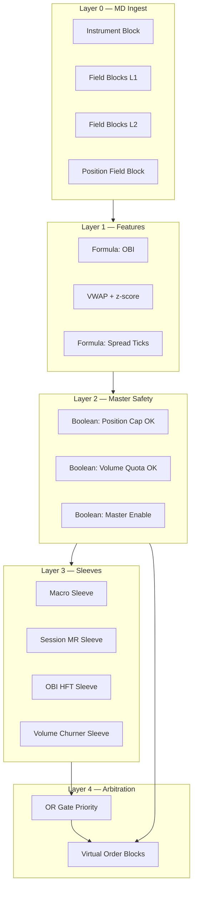

# ZN Sep26 Competition Algorithm — TT ADL Build Specification

This document maps the **Python reference implementation** in this repository (`zn_competition/strategies/`) to a production **Trading Technologies ADL (Algorithm Design Language)** graph for **ZN Sep 2026 (U26)** on Globex.

**Reference sources:** `PLAYBOOK.md`, `TT_DEBUG_CHECKLIST.md`, `specs.py`, `macro_event.py`, `session_mr.py`, `volume_aware_mm.py`, `features.py`, `risk.py`.

**Competition constants (hard-code or expose as Algo Dashboard inputs):**

| Parameter | Value |
|-----------|--------|
| Instrument | ZN Sep26 (U26) |
| Tick size | 1/64 point (0.015625) |
| Tick value | $15.625 / contract / tick |
| Fee | $0.50 / lot / side ($1.00 round-turn) |
| Max position | **10 lots** absolute |
| Weekly volume min | W1=200, W2=300, W3=400, W4=500 |
| Total volume min | 2,000 legs (competition) |

---

## 1. ADL graph topology (high level)

Build **one parent algo** with six logical layers executed **once per market data event** (book update):



**Sleeve priority (matches `strategies/engine.py` + `historical.py`):**

1. **Macro** (highest) — post-release only  
2. **Session mean reversion** — VWAP z-score  
3. **OBI HFT** — L1+L2 imbalance (also used as volume pad in playbook)  
4. **Volume churner** — only when **flat** and weekly quota not met  

Only **one sleeve** may arm Virtual Order Blocks per event unless explicitly designed for simultaneous churn (two-sided quotes).

---

## 2. Instrument & market data blocks

### 2.1 Instrument Block

| Block name (ADL library) | Setting | Notes |
|--------------------------|---------|--------|
| **Instrument Block** | Product = `ZN`, Maturity = `Sep 2026` / code `U26` | Single-instrument algo; no ZF/ZB |
| Exchange | CME Globex | Per checklist |
| Tick size override | Confirm **1/32** display, **half-tick** order increment (1/64) | Matches `TICK_SIZE_FLOAT` |

**Wiring:** Instrument Block **Instrument Out** → all Field Blocks, Virtual Order Blocks, Position Field Block.

---

### 2.2 Field Blocks — Level 1 (inside market)

Create one **Field Block** per field. Set **MD Type** = Inside Market (or Best Bid/Offer).

| Field Block name (rename in canvas) | ADL field source | Python equivalent |
|-------------------------------------|------------------|-------------------|
| `fld_InsideBid` | Inside Bid Price | `quote.bid` |
| `fld_InsideAsk` | Inside Ask Price | `quote.ask` |
| `fld_BidQty_L1` | Inside Bid Quantity | `quote.bid_size` |
| `fld_AskQty_L1` | Inside Ask Quantity | `quote.ask_size` |
| `fld_Mid` | *(optional)* Mid or Formula `(Bid+Ask)/2` | `quote.mid` |
| `fld_Last` | Last Traded Price | `quote.last` |
| `fld_TradeVol` | Last Trade Volume / Tick Vol | `quote.volume` |

**Wiring:**

- `fld_InsideBid` → **Numeric Formula** blocks (spread, passive bid price)  
- `fld_InsideAsk` → **Numeric Formula** blocks (passive ask price)  
- `fld_BidQty_L1` + `fld_AskQty_L1` → **OBI Formula** (see §3.1)  
- `fld_TradeVol` → **Session VWAP Accumulator** (see §3.2)  

---

### 2.3 Field Blocks — Level 2 (depth)

Enable **CME Market Depth** in TT (checklist §2). Add depth Field Blocks for **second level** (one tick away or explicit Level 2 index per your MD config):

| Field Block name | ADL field source | Python equivalent |
|------------------|------------------|-------------------|
| `fld_BidQty_L2` | Bid Quantity @ Level 2 | `quote.bid_l2_size` |
| `fld_AskQty_L2` | Ask Quantity @ Level 2 | `quote.ask_l2_size` |

If your ADL build exposes **Bid Size at Price** ladders instead of L2 index, wire **second rung bid/ask quantities** into these fields equivalently.

**Wiring:**

- `fld_BidQty_L1` + `fld_BidQty_L2` + `fld_AskQty_L1` + `fld_AskQty_L2` → **Formula Block `fml_OBI`** (§3.1)

---

### 2.4 Position & account Field Blocks

| Field Block name | ADL field source | Use |
|------------------|------------------|-----|
| `fld_NetPosition` | Net Position (Instrument) | `ctx.position` — signed |
| `fld_AvgOpenPrice` | Average Open Price | Scratch / flatten reference |
| `fld_WorkingBuyQty` | Working Buy Quantity | Prevent duplicate bids |
| `fld_WorkingSellQty` | Working Sell Quantity | Prevent duplicate asks |
| `fld_SessionPnL` | Session PnL | Daily stop ($1,500–$2,500) |
| `fld_FillQty_Total` | Session Fill Quantity (legs) | Volume quota counter |

**Wiring:**

- `fld_NetPosition` → **all Boolean cap guards** (§4)  
- `fld_FillQty_Total` → **Comparison Block** vs weekly target (§4.2)  

---

## 3. Formula & feature blocks

### 3.1 Formula Block — Order Book Imbalance (OBI)

**Block:** `fml_OBI` (**Numeric Formula Block**)

**Inputs (wire explicitly):**

| Input port | Source block |
|------------|--------------|
| `BidL1` | `fld_BidQty_L1` → Value Out |
| `BidL2` | `fld_BidQty_L2` → Value Out |
| `AskL1` | `fld_AskQty_L1` → Value Out |
| `AskL2` | `fld_AskQty_L2` → Value Out |

**Formula (single expression or chained sub-formulas):**

```text
BidSum = BidL1 + BidL2
AskSum = AskL1 + AskL2
Total  = BidSum + AskSum
OBI    = IF(Total > 0, (BidSum - AskSum) / Total, 0)
```

Maps to `calculate_order_book_imbalance()` in `microstructure.py`.

**Outputs:**

- `fml_OBI` → Comparison Blocks for thresholds **0.7** and **-0.7**  
- `fml_OBI` → OBI sleeve + scratch flip detection  

---

### 3.2 Session VWAP & z-score (mean reversion)

**Blocks required:**

| Block name | Type | Purpose |
|------------|------|---------|
| `acc_VWAP` | **Accumulator Block** or TT **VWAP Block** (session reset) | Session-anchored VWAP |
| `fml_Mid` | Numeric Formula | `(InsideBid + InsideAsk) / 2` |
| `fml_VWAP_Dev` | Numeric Formula | `(Mid - VWAP) / TickSize` → ticks from VWAP |
| `acc_VolRoll` | Rolling std / variance (Formula + delay line) | `realized_vol_ticks_1h` proxy |
| `fml_VWAP_Z` | Numeric Formula | `VWAP_Dev / MAX(RollingStd, 0.5)` |

**Wiring:**

- `fml_Mid` ← `fld_InsideBid`, `fld_InsideAsk`  
- `acc_VWAP` ← `fml_Mid` (price) × `fld_TradeVol` (weight); reset **Time Filter** at session start (07:20 CT per playbook)  
- `fml_VWAP_Dev` ← `fml_Mid`, `acc_VWAP`  
- `fml_VWAP_Z` → MR entry/exit Comparisons  

**Thresholds (Comparison Blocks):**

| Comparison name | Condition | Python |
|-----------------|-----------|--------|
| `cmp_MR_Enter` | `ABS(VWAP_Z) > 1.25` | `entry_z` |
| `cmp_MR_Exit` | `ABS(VWAP_Z) < 0.35` | `exit_z` |

---

### 3.3 Formula Block — Spread in ticks

**Block:** `fml_SpreadTicks` (**Numeric Formula Block**)

```text
SpreadTicks = (InsideAsk - InsideBid) / 0.015625
```

**Wiring:** `fld_InsideBid`, `fld_InsideAsk` → `fml_SpreadTicks` → Boolean `cmp_SpreadOK` where `SpreadTicks <= 2.0` (MR, OBI, churn).

---

### 3.4 Time Filter Blocks (liquidity windows)

| Block name | Type | Window (CT) | Python |
|------------|------|-------------|--------|
| `tf_USMorning` | **Time Filter Block** | 07:20 – 10:00 | `HIGH_LIQUIDITY_WINDOWS_CT[0]` |
| `tf_USMid` | Time Filter Block | 12:00 – 15:00 | `[1]` |
| `tf_USClose` | Time Filter Block | 18:00 – 20:00 | `[2]` |
| `tf_HighLiq` | **OR Gate** | `tf_USMorning OR tf_USMid OR tf_USClose` | `session_tag == high_liquidity` |

**Wiring:** `tf_HighLiq` → **AND** with MR enable (MR only trades in high-liq window per `session_mr.py`).

---

## 4. Master safety guards (10-lot cap & quotas)

These Booleans gate **every** Virtual Order Block **Enable** pin. This mirrors `enforce_order_size()` / `ExecutionException` in `risk.py` — **no silent clip** in ADL: if guard is false, orders do not fire.

### 4.1 Boolean Formula — position cap (native matching-engine safe)

**Block:** `bool_PosCapOK` (**Boolean Formula Block**)

Define **user variables** (Algo Dashboard / Numeric Variable Blocks):

| Variable | Default | Meaning |
|----------|---------|---------|
| `uv_MaxPos` | 10 | Competition max lots |
| `uv_OrderQty_Macro` | 1–4 | Per-event size |
| `uv_OrderQty_MR` | 2 | MR size |
| `uv_OrderQty_OBI` | 1 | OBI size |
| `uv_OrderQty_Churn` | 1 | Churn per side |

For **each** Virtual Order Block with order quantity `Q` (positive integer):

```text
ProjectedLong  = NetPosition + Q    // buy orders
ProjectedShort = NetPosition - Q    // sell orders

bool_BuyCapOK  = (ProjectedLong  <= uv_MaxPos) AND (ProjectedLong  >= -uv_MaxPos)
bool_SellCapOK = (ProjectedShort <= uv_MaxPos) AND (ProjectedShort >= -uv_MaxPos)
bool_FlatCapOK = (ABS(NetPosition) <= uv_MaxPos)
```

**Per-order wiring example (Virtual Buy Order Block `vob_MacroBuy`):**

| Virtual Buy `Enable` input | Wire from |
|--------------------------|-----------|
| Enable | `bool_MasterEnable` **AND** `bool_BuyCapOK` **AND** `bool_MacroFire` **AND** `NOT bool_MacroBlocked` |

Repeat for every buy/sell VOB with the appropriate `Q` = that block’s quantity.

**Absolute position already at cap:**

| Block | Formula |
|-------|---------|
| `bool_AlreadyAtMaxLong` | `NetPosition >= uv_MaxPos` |
| `bool_AlreadyAtMaxShort` | `NetPosition <= -uv_MaxPos` |

**Wiring:** `bool_AlreadyAtMaxLong` → inhibit new **Buy** VOBs; `bool_AlreadyAtMaxShort` → inhibit new **Sell** VOBs.

This enforces Python logic: `position < 10` for long entries, `position > -10` for short entries.

---

### 4.2 Boolean — weekly volume quota shutoff

**Blocks:**

| Block name | Type | Logic |
|------------|------|--------|
| `uv_WeeklyTarget` | Numeric Variable | 200 / 300 / 400 / 500 by week |
| `fld_LegsThisWeek` | Field / user counter | Increment **+Qty** on every **Fill** event |
| `cmp_VolRemaining` | Comparison | `fld_LegsThisWeek < uv_WeeklyTarget` |
| `bool_VolQuotaOK` | Boolean | `cmp_VolRemaining` TRUE |

**Wiring:**

- `bool_VolQuotaOK` → **AND** into **Volume Churner** and optional OBI pad paths  
- When false → **Disable** churn VOB pair; set Flip-Flop `ff_ChurnActive` = FALSE  

Maps to `VolumeChurner.weekly_quota_satisfied()` and `process_tick` → `quota_off`.

---

### 4.3 Boolean — macro event lockout

**Blocks:**

| Block name | Type | Logic |
|------------|------|--------|
| `uv_MacroLockout` | Boolean Variable | Manual / message triggered |
| `tf_MacroBlackout` | Time Filter | ±2 min around releases (checklist §4) |
| `bool_MacroBlocked` | OR Gate | `uv_MacroLockout OR tf_MacroBlackout` |

**Blocked tags (disable MR + churn; macro sleeve has its own path):**

FOMC, NFP, CPI, 10Y auction, 30Y auction — wire from **User Message Block** parsing or external signal.

**Wiring:** `bool_MacroBlocked` → **NOT** → AND with MR and Churn enables.

---

### 4.4 Boolean — master kill switch

| Block name | Formula |
|------------|---------|
| `bool_DailyLossOK` | `SessionPnL > -uv_DailyLossLimit` (default 1500) |
| `bool_MasterEnable` | `bool_DailyLossOK AND NOT bool_HardFlat` AND Algo enabled |

**Wiring:** `bool_MasterEnable` → **AND** on **every** VOB Enable pin.

**TT Risk Guardian (platform — mandatory per checklist):**

Configure **outside** ADL but treat as hard backstop:

| Risk Guardian setting | Value |
|-----------------------|--------|
| Max Position (ZN U26) | **10** |
| Max Order Size | **10** (or per-sleeve max 4) |
| Max Loss (optional) | $1,500 – $2,500 |
| Action on breach | **Disable trading** + cancel working |

ADL `bool_PosCapOK` is the **primary** guard; Risk Guardian is **fail-safe** if ADL mis-wires.

---

## 5. Sleeve A — Macro event (`macro_event.py`)

### 5.1 Inputs

| Source | Field |
|--------|--------|
| **User Message Block** or external clock | `EventTag`, `EventPhase` (pre/release/post) |
| Numeric Variable | `uv_SurpriseBp` (10Y equiv surprise, signed) |

### 5.2 Boolean logic

| Block name | Condition |
|------------|-----------|
| `bool_MacroPost` | `EventPhase == POST` |
| `bool_SurpriseOK` | `ABS(SurpriseBp) >= 0.5` |
| `bool_MacroHot` | `SurpriseBp > 0` → **Sell** ZN |
| `bool_MacroCold` | `SurpriseBp < 0` → **Buy** ZN |
| `bool_MacroFire` | `bool_MacroPost AND bool_SurpriseOK AND bool_MacroEventKnown` |

**Size Formula Block `fml_MacroQty`:**

```text
BaseQty = EventTable(EventTag)   // FOMC=4, NFP=3, CPI=3, 10Y=2
If RollingVol > 8 ticks Then BaseQty = MAX(1, BaseQty / 2)
MacroQty = MIN(BaseQty, uv_MaxPos - ABS(NetPosition))
```

### 5.3 Virtual Order Blocks

| Block name | Side | Price | Qty | Enable |
|------------|------|-------|-----|--------|
| `vob_MacroBuy` | Buy | **Aggressive** (Inside Ask or Pay Up 1 tick) | `fml_MacroQty` | `bool_MasterEnable AND bool_BuyCapOK AND bool_MacroFire AND bool_MacroCold` |
| `vob_MacroSell` | Sell | **Aggressive** (Inside Bid or Pay Down 1 tick) | `fml_MacroQty` | `bool_MasterEnable AND bool_SellCapOK AND bool_MacroFire AND bool_MacroHot` |

**Order type:** **Limit IOC/FOK** or market equivalent for aggressive post-release.

**Wiring:** `fld_InsideBid` / `fld_InsideAsk` → VOB price pins per aggression mode.

---

## 6. Sleeve B — Session mean reversion (`session_mr.py`)

### 6.1 Entry (passive)

| Boolean | Gates |
|---------|--------|
| `bool_MR_Enter` | `ABS(VWAP_Z) > 1.25` |
| `bool_MR_Long` | `VWAP_Z < -1.25` → **Buy** (fade cheap) |
| `bool_MR_Short` | `VWAP_Z > 1.25` → **Sell** (fade rich) |
| `bool_MR_EnterEnable` | `bool_MR_Enter AND tf_HighLiq AND cmp_SpreadOK AND NOT bool_MacroBlocked AND bool_VolQuotaOK` |

| Virtual Order Block | Side | Price | Qty | Enable |
|---------------------|------|-------|-----|--------|
| `vob_MR_Buy` | Buy | **Inside Bid** (passive) | `uv_OrderQty_MR` | `bool_MasterEnable AND bool_BuyCapOK AND bool_MR_EnterEnable AND bool_MR_Long` |
| `vob_MR_Sell` | Sell | **Inside Ask** (passive) | `uv_OrderQty_MR` | `bool_MasterEnable AND bool_SellCapOK AND bool_MR_EnterEnable AND bool_MR_Short` |

### 6.2 Exit (aggressive flatten)

| Boolean | `ABS(VWAP_Z) < 0.35 AND NetPosition != 0` |
|---------|---------------------------------------------|
| `vob_MR_ExitSell` | Sell @ aggressive, Qty = `ABS(NetPosition)`, Enable if long |
| `vob_MR_ExitBuy` | Buy @ aggressive, Qty = `ABS(NetPosition)`, Enable if short |

---

## 7. Sleeve C — OBI HFT (`volume_aware_mm.py`)

### 7.1 Entry

| Comparison | Threshold |
|------------|-------------|
| `cmp_OBI_Long` | `OBI > 0.7` AND `NetPosition < 10` |
| `cmp_OBI_Short` | `OBI < -0.7` AND `NetPosition > -10` |

| Virtual Order Block | Side | Price | Qty | Enable |
|---------------------|------|-------|-----|--------|
| `vob_OBI_Bid` | Buy | **Inside Bid** | 1 | `bool_MasterEnable AND bool_BuyCapOK AND cmp_OBI_Long AND cmp_SpreadOK AND NOT bool_MacroBlocked` |
| `vob_OBI_Ask` | Sell | **Inside Ask** | 1 | `bool_MasterEnable AND bool_SellCapOK AND cmp_OBI_Short AND cmp_SpreadOK AND NOT bool_MacroBlocked` |

Use **Once Per Tick** or state Flip-Flop `ff_OBI_Working` to avoid stacking duplicate quotes.

### 7.2 Scratch on book flip

| Boolean | Condition |
|---------|-----------|
| `bool_OBI_ScratchLong` | `OpenLong AND OBI <= -0.7` |
| `bool_OBI_ScratchShort` | `OpenShort AND OBI >= 0.7` |

| Virtual Order Block | Action |
|---------------------|--------|
| `vob_OBI_ScratchSell` | Sell @ **AvgOpenPrice** or Inside Ask aggressive, Qty = open qty |
| `vob_OBI_ScratchBuy` | Buy @ **AvgOpenPrice** or Inside Bid aggressive, Qty = open qty |

Track open state with **Flip-Flop Block** `ff_OBI_InTrade` + storage Numeric Variables for entry price.

---

## 8. Sleeve D — Volume churner (`session_mr.py` → `VolumeChurner`)

**Precondition (Boolean):**

```text
bool_ChurnArm = (NetPosition == 0)
            AND bool_VolQuotaOK
            AND cmp_SpreadOK
            AND NOT bool_MacroBlocked
            AND NOT bool_MR_Active   // optional: inhibit if MR fired this tick
```

### 8.1 Simultaneous inside quotes (class method equivalent)

When `bool_ChurnArm` rises (edge-trigger **Flip-Flop** `ff_ChurnArmed`):

| Virtual Order Block | Side | Price wire | Qty | Enable |
|---------------------|------|------------|-----|--------|
| `vob_Churn_Bid` | Buy | `fld_InsideBid` → Limit Price | `uv_OrderQty_Churn` (1) | `bool_MasterEnable AND bool_BuyCapOK AND ff_ChurnArmed` |
| `vob_Churn_Ask` | Sell | `fld_InsideAsk` → Limit Price | `uv_OrderQty_Churn` (1) | `bool_MasterEnable AND bool_SellCapOK AND ff_ChurnArmed` |

**Wiring (precise):**

1. `fld_InsideBid` **Value Out** → `vob_Churn_Bid` **Limit Price**  
2. `fld_InsideAsk` **Value Out** → `vob_Churn_Ask` **Limit Price**  
3. `fld_BidQty_L1` / `fld_AskQty_L1` — **not** used for churn trigger (flat inventory neutral intent)  
4. On **Fill** of either side → increment `fld_LegsThisWeek` by fill qty  
5. If `NetPosition != 0` after partial fill → arm `vob_Churn_Flatten` at inside opposite price (maps `_flatten_inventory`)  
6. When `fld_LegsThisWeek >= uv_WeeklyTarget` → reset `ff_ChurnArmed`, disable both churn VOBs  

**Churn urgency threshold (Python):** only arm when `weekly_min_remaining <= 40` — add:

| Comparison | `WeeklyTarget - LegsThisWeek <= 40` |
|------------|-------------------------------------|

---

## 9. Arbitration & conflict prevention

**Problem:** Multiple sleeves must not send conflicting orders same event.

**Solution blocks:**

| Block name | Type | Logic |
|------------|------|--------|
| `ff_MacroFired` | Flip-Flop | Set on macro fill this event |
| `ff_MRFired` | Flip-Flop | Set on MR fill |
| `pri_Gate` | Cascaded AND | Macro > MR > OBI > Churn |

**Wiring:**

- If `ff_MacroFired` → disable `vob_MR_*`, `vob_OBI_*`, `vob_Churn_*` enables this tick  
- Else if `ff_MRFired` → disable OBI/Churn  
- Else if `ff_OBI_InTrade` → disable Churn  
- Else allow Churn if `bool_ChurnArm`  

Add **Disable Algo Block** path if `ABS(NetPosition) > 10` detected (should never fire if guards correct) — log alert Message Block.

---

## 10. Fill accounting & fee awareness

On every **Fill Event** (Fill Field Block or Order Block fill output):

| Action | Block |
|--------|--------|
| `LegsThisWeek += FillQty` | Accumulator |
| `LegsTotal += FillQty` | Accumulator |
| Log `ReasonCode` string | Message Block tags: `macro_*`, `mr_*`, `obi_*`, `volume_churn_*` |

**Fee sanity (offline):** `TotalFees = 0.50 * LegsThisWeek` — compare to competition dashboard.

---

## 11. Algo Dashboard parameters (recommended)

| Parameter | Default | Sleeve |
|-----------|---------|--------|
| `uv_MaxPos` | 10 | All |
| `uv_WeeklyTarget` | 200 | Churn |
| `uv_EntryZ` | 1.25 | MR |
| `uv_ExitZ` | 0.35 | MR |
| `uv_OBI_Entry` | 0.70 | OBI |
| `uv_OBI_Flip` | -0.70 | OBI scratch |
| `uv_DailyLossLimit` | 1500 | Master |
| `uv_ChurnUrgencyLeft` | 40 | Churn arm |
| `uv_MacroQty_FOMC` | 4 | Macro |
| `uv_MacroQty_NFP` | 3 | Macro |

---

## 12. Build & deployment checklist (maps to `TT_DEBUG_CHECKLIST.md`)

1. [ ] Instrument Block = ZN Sep26 only  
2. [ ] Depth + inside Field Blocks wired to `fml_OBI`  
3. [ ] VWAP session reset at 07:20 CT  
4. [ ] All VOB Enable pins include `bool_MasterEnable AND bool_BuyCapOK` or Sell variant  
5. [ ] Risk Guardian Max Position = **10**  
6. [ ] Paper trade 2 sessions — MR only, then full stack  
7. [ ] Export fills; compare leg count to `fld_LegsThisWeek`  
8. [ ] Verify passive = Join Bid/Ask; macro = aggressive  
9. [ ] Overnight: confirm GTD/GTC behavior matches competition  

---

## 13. Python ↔ ADL traceability matrix

| Python module | ADL section | Key function |
|---------------|-------------|--------------|
| `macro_event.py` | §5 | `MacroEventStrategy.on_tick` |
| `session_mr.py` (MR) | §6 | `_mean_reversion_signal` |
| `volume_aware_mm.py` | §7 | `OrderBookImbalanceHFT.process_tick` |
| `session_mr.py` (churn) | §8 | `VolumeChurner.place_offsetting_inside_quotes` |
| `risk.py` | §4 | `enforce_order_size`, `ExecutionException` |
| `features.py` | §3.2 | `MicrostructureFeatureEngine.update` |
| `microstructure.py` | §3.1 | `calculate_order_book_imbalance` |
| `economics.py` | §10 | `net_pnl_from_tick_move` (validation only) |

---

## 14. Notes on TT ADL versions

Block names (**Field Block**, **Numeric Formula Block**, **Boolean Formula Block**, **Virtual Buy Order Block**, **Virtual Sell Order Block**, **Comparison Block**, **AND Gate**, **OR Gate**, **Flip-Flop Block**, **Time Filter Block**, **Accumulator Block**, **User Message Block**, **Disable Algo Block**, **Position Field Block**) are consistent with TT ADL Designer 7.x library naming.

If your workstation uses alternate labels (e.g. **Quote Block** instead of separate Virtual Bid/Ask), functionally map:

- **Quote Block** (Bid mode) ≡ `vob_Churn_Bid` / `vob_OBI_Bid`  
- **Quote Block** (Ask mode) ≡ `vob_Churn_Ask` / `vob_OBI_Ask`  

Always verify exact block names in **ADL → Block Library** search before wiring.

---

*End of specification — maintain parity with `zn_competition/` Python reference; any parameter change must update both.*
