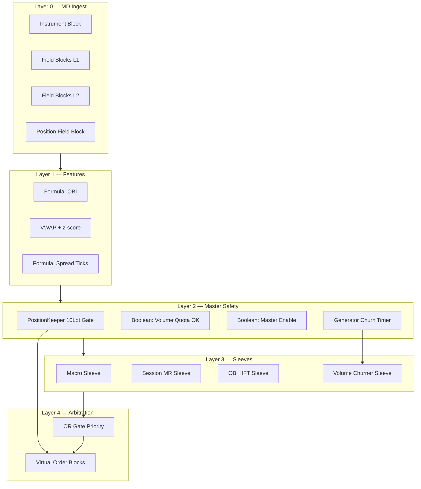
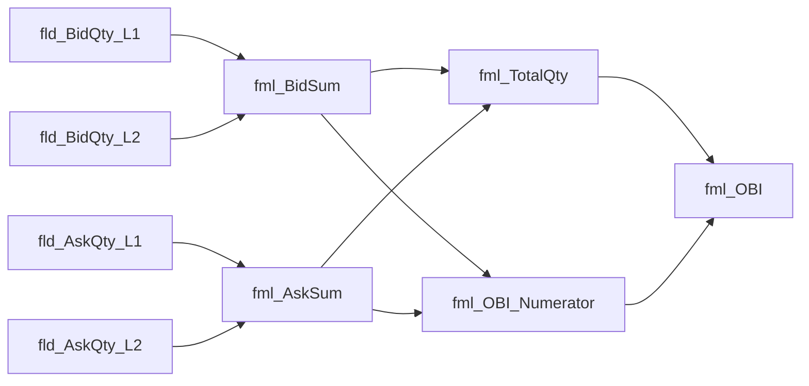
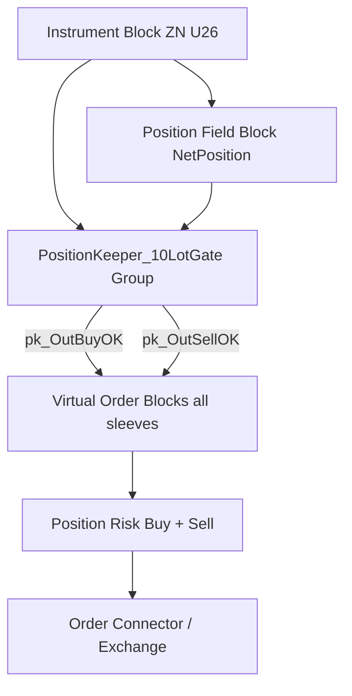
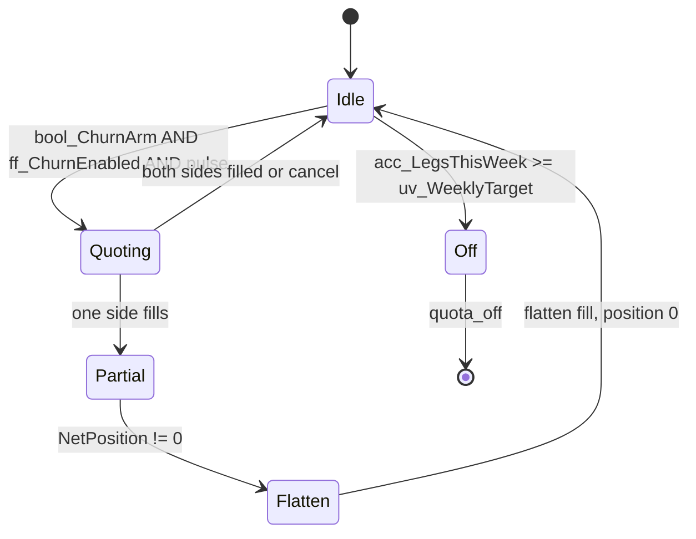

# ZN Sep26 Competition Algorithm — TT ADL Build Specification

This document maps the **Python reference implementation** in this repository (`zn_competition/strategies/`) to a production **Trading Technologies ADL (Algorithm Design Language)** graph for **ZN Sep 2026 (U26)** on Globex.

**Reference sources:** `PLAYBOOK.md`, `TT_DEBUG_CHECKLIST.md`, `specs.py`, `macro_event.py`, `session_mr.py`, `volume_aware_mm.py`, `microstructure.py`, `features.py`, `risk.py`.

**Drag-and-drop manuals in this doc:** §3.1 (OBI Formula chain), §4.0 (Position Keeper ±10 gate), §8.0 (Volume Churner + Generator timer).

**Competition constants (hard-code or expose as Algo Dashboard inputs):**

| Parameter | Value |
|-----------|--------|
| Instrument | ZN Sep26 (U26) |
| Tick size | 1/64 point (0.015625) |
| Tick value | $15.625 / contract / tick |
| Fee | $0.50 / lot / side ($1.00 round-turn) |
| Max position | **10 lots** absolute |
| Weekly volume min | W1=200, W2=300, W3=400, W4=500 |
| Total volume min | 2,000 legs (competition) |

---

## 1. ADL graph topology (high level)

Build **one parent algo** with six logical layers executed **once per market data event** (book update):



**Sleeve priority (matches `strategies/engine.py` + `historical.py`):**

1. **Macro** (highest) — post-release only  
2. **Session mean reversion** — VWAP z-score  
3. **OBI HFT** — L1+L2 imbalance (also used as volume pad in playbook)  
4. **Volume churner** — only when **flat** and weekly quota not met  

Only **one sleeve** may arm Virtual Order Blocks per event unless explicitly designed for simultaneous churn (two-sided quotes).

---

## 2. Instrument & market data blocks

### 2.1 Instrument Block

| Block name (ADL library) | Setting | Notes |
|--------------------------|---------|--------|
| **Instrument Block** | Product = `ZN`, Maturity = `Sep 2026` / code `U26` | Single-instrument algo; no ZF/ZB |
| Exchange | CME Globex | Per checklist |
| Tick size override | Confirm **1/32** display, **half-tick** order increment (1/64) | Matches `TICK_SIZE_FLOAT` |

**Wiring:** Instrument Block **Instrument Out** → all Field Blocks, Virtual Order Blocks, Position Field Block.

---

### 2.2 Field Blocks — Level 1 (inside market)

Create one **Field Block** per field. Set **MD Type** = Inside Market (or Best Bid/Offer).

| Field Block name (rename in canvas) | ADL field source | Python equivalent |
|-------------------------------------|------------------|-------------------|
| `fld_InsideBid` | Inside Bid Price | `quote.bid` |
| `fld_InsideAsk` | Inside Ask Price | `quote.ask` |
| `fld_BidQty_L1` | Inside Bid Quantity | `quote.bid_size` |
| `fld_AskQty_L1` | Inside Ask Quantity | `quote.ask_size` |
| `fld_Mid` | *(optional)* Mid or Formula `(Bid+Ask)/2` | `quote.mid` |
| `fld_Last` | Last Traded Price | `quote.last` |
| `fld_TradeVol` | Last Trade Volume / Tick Vol | `quote.volume` |

**Wiring:**

- `fld_InsideBid` → **Numeric Formula** blocks (spread, passive bid price)  
- `fld_InsideAsk` → **Numeric Formula** blocks (passive ask price)  
- `fld_BidQty_L1` + `fld_AskQty_L1` → **OBI Formula** (see §3.1)  
- `fld_TradeVol` → **Session VWAP Accumulator** (see §3.2)  

---

### 2.3 Field Blocks — Level 2 (depth)

Enable **CME Market Depth** in TT (checklist §2). Add depth Field Blocks for **second level** (one tick away or explicit Level 2 index per your MD config):

| Field Block name | ADL field source | Python equivalent |
|------------------|------------------|-------------------|
| `fld_BidQty_L2` | Bid Quantity @ Level 2 | `quote.bid_l2_size` |
| `fld_AskQty_L2` | Ask Quantity @ Level 2 | `quote.ask_l2_size` |

If your ADL build exposes **Bid Size at Price** ladders instead of L2 index, wire **second rung bid/ask quantities** into these fields equivalently.

**Wiring:**

- `fld_BidQty_L1` + `fld_BidQty_L2` + `fld_AskQty_L1` + `fld_AskQty_L2` → **Formula Block `fml_OBI`** (§3.1)

---

### 2.4 Position & account Field Blocks

| Field Block name | ADL field source | Use |
|------------------|------------------|-----|
| `fld_NetPosition` | Net Position (Instrument) | `ctx.position` — signed |
| `fld_AvgOpenPrice` | Average Open Price | Scratch / flatten reference |
| `fld_WorkingBuyQty` | Working Buy Quantity | Prevent duplicate bids |
| `fld_WorkingSellQty` | Working Sell Quantity | Prevent duplicate asks |
| `fld_SessionPnL` | Session PnL | Daily stop ($1,500–$2,500) |
| `fld_FillQty_Total` | Session Fill Quantity (legs) | Volume quota counter |

**Wiring:**

- `fld_NetPosition` → **all Boolean cap guards** (§4)  
- `fld_FillQty_Total` → **Comparison Block** vs weekly target (§4.2)  

---

## 3. Formula & feature blocks

### 3.1 OBI — Python → TT ADL Formula Block manual (drag-and-drop)

**Python source of truth** (`microstructure.py` → `OrderBookImbalanceCalculator`):

```python
bid_qty = bid_l1_size + bid_l2_size
ask_qty = ask_l1_size + ask_l2_size
obi = (bid_qty - ask_qty) / (bid_qty + ask_qty) if (bid_qty + ask_qty) > 0 else 0.0
```

**Strategy thresholds** (`volume_aware_mm.py` → `OrderBookImbalanceHFT`):

| Constant | Value | ADL variable |
|----------|-------|--------------|
| `OBI_ENTRY_THRESHOLD` | **0.7** | `uv_OBI_Entry` |
| `OBI_FLIP_AGAINST_THRESHOLD` | **-0.7** | `uv_OBI_Flip` |
| `OBI_SHORT_ENTRY_THRESHOLD` | **-0.7** | `uv_OBI_ShortEntry` |
| Working-quote hold (long) | OBI **> 0.35** (`0.7 × 0.5`) | `uv_OBI_HoldLong` |
| Working-quote hold (short) | OBI **< -0.35** | `uv_OBI_HoldShort` |
| Max spread | **≤ 2.0** ticks | `cmp_SpreadOK` |
| Max vol (1h proxy) | **≤ 4.0** ticks | `cmp_VolOK` |

Build OBI as a **chain of Numeric Formula Blocks** (one expression per block — easier to debug on canvas than one mega-formula). Wire **continuous** Value Out ports left-to-right:



#### Step-by-step block placement

| # | Rename on canvas | Block type | Formula (Formula Editor) | Inputs wired from |
|---|------------------|------------|----------------------------|-------------------|
| 1 | `fml_BidSum` | **Numeric Formula Block** | `@fld_BidQty_L1 + @fld_BidQty_L2` | L1 + L2 bid Field Blocks |
| 2 | `fml_AskSum` | Numeric Formula Block | `@fld_AskQty_L1 + @fld_AskQty_L2` | L1 + L2 ask Field Blocks |
| 3 | `fml_TotalQty` | Numeric Formula Block | `@fml_BidSum + @fml_AskSum` | `fml_BidSum`, `fml_AskSum` |
| 4 | `fml_OBI_Numerator` | Numeric Formula Block | `@fml_BidSum - @fml_AskSum` | `fml_BidSum`, `fml_AskSum` |
| 5 | `fml_OBI` | Numeric Formula Block | `IF(@fml_TotalQty > 0, @fml_OBI_Numerator / @fml_TotalQty, 0)` | numerator, total |

**Output:** `fml_OBI` **Value Out** (numeric, range **[-1, +1]**) fans out to every OBI Comparison and Boolean below.

> **Parity check:** With `BidL1=300, BidL2=200, AskL1=100, AskL2=100` → `BidSum=500`, `AskSum=200`, `OBI = 300/700 ≈ 0.4286`. Matches `tests/test_obi_hft.py`.

#### Comparison Blocks (strict inequalities match Python)

Python uses **strict** comparisons for fills (`obi < entry_threshold` rejects bid fill). Wire **Comparison Blocks** as follows:

| Block name | Left operand | Operator | Right | Python equivalent |
|------------|--------------|----------|-------|-------------------|
| `cmp_OBI_LongEntry` | `fml_OBI` | **>** | `uv_OBI_Entry` (0.7) | `obi > entry_threshold` |
| `cmp_OBI_ShortEntry` | `fml_OBI` | **<** | `uv_OBI_ShortEntry` (-0.7) | `obi < short_entry_threshold` |
| `cmp_OBI_ScratchLong` | `fml_OBI` | **≤** | `uv_OBI_Flip` (-0.7) | `obi <= flip_threshold` (long scratch) |
| `cmp_OBI_ScratchShort` | `fml_OBI` | **≥** | `0.7` (i.e. `-flip_threshold`) | `obi >= -flip_threshold` (short scratch) |
| `cmp_OBI_HoldBid` | `fml_OBI` | **>** | `uv_OBI_HoldLong` (0.35) | `_still_quoting_favorable` BUY |
| `cmp_OBI_HoldAsk` | `fml_OBI` | **<** | `uv_OBI_HoldShort` (-0.35) | `_still_quoting_favorable` SELL |
| `cmp_OBI_BidFillOK` | `fml_OBI` | **≥** | `uv_OBI_Entry` (0.7) | fill gate: NOT `obi < entry` |
| `cmp_OBI_AskFillOK` | `fml_OBI` | **≤** | `uv_OBI_ShortEntry` (-0.7) | fill gate: NOT `obi > short_entry` |

#### Boolean gates → Virtual Order Blocks (OBI sleeve)

| Boolean block | Expression | Feeds |
|---------------|------------|-------|
| `bool_OBI_LongArm` | `cmp_OBI_LongEntry AND (NetPosition < uv_MaxPos) AND cmp_SpreadOK AND cmp_VolOK AND NOT bool_MacroBlocked` | `vob_OBI_Bid` **Enable** (via Position Keeper AND) |
| `bool_OBI_ShortArm` | `cmp_OBI_ShortEntry AND (NetPosition > -uv_MaxPos) AND cmp_SpreadOK AND cmp_VolOK AND NOT bool_MacroBlocked` | `vob_OBI_Ask` **Enable** |
| `bool_OBI_ScratchLong` | `ff_OBI_InTrade AND OpenLong AND cmp_OBI_ScratchLong` | `vob_OBI_ScratchSell` |
| `bool_OBI_ScratchShort` | `ff_OBI_InTrade AND OpenShort AND cmp_OBI_ScratchShort` | `vob_OBI_ScratchBuy` |

**Price wiring (passive inside market):**

| VOB | Limit Price In | Qty |
|-----|----------------|-----|
| `vob_OBI_Bid` | `fld_InsideBid` → Value Out | `uv_OrderQty_OBI` (1) |
| `vob_OBI_Ask` | `fld_InsideAsk` → Value Out | 1 |
| `vob_OBI_ScratchSell` | `fld_AvgOpenPrice` or aggressive `fld_InsideAsk` | open qty |
| `vob_OBI_ScratchBuy` | `fld_AvgOpenPrice` or aggressive `fld_InsideBid` | open qty |

**State Flip-Flops** (mirror `OrderBookImbalanceHFT._working_order` / `_open_trade`):

| Flip-Flop | Set TRUE on | Reset FALSE on |
|-----------|-------------|----------------|
| `ff_OBI_Working` | VOB armed | fill or cancel unfavorable (`NOT cmp_OBI_HoldBid/Ask`) |
| `ff_OBI_InTrade` | passive fill | scratch fill complete |

Scratch economics: flat at entry price → **$1.00/lot round-turn** fee drag (`scratch_net_pnl_usd`); no tick gross.

---

### 3.2 Session VWAP & z-score (mean reversion)

**Blocks required:**

| Block name | Type | Purpose |
|------------|------|---------|
| `acc_VWAP` | **Accumulator Block** or TT **VWAP Block** (session reset) | Session-anchored VWAP |
| `fml_Mid` | Numeric Formula | `(InsideBid + InsideAsk) / 2` |
| `fml_VWAP_Dev` | Numeric Formula | `(Mid - VWAP) / TickSize` → ticks from VWAP |
| `acc_VolRoll` | Rolling std / variance (Formula + delay line) | `realized_vol_ticks_1h` proxy |
| `fml_VWAP_Z` | Numeric Formula | `VWAP_Dev / MAX(RollingStd, 0.5)` |

**Wiring:**

- `fml_Mid` ← `fld_InsideBid`, `fld_InsideAsk`  
- `acc_VWAP` ← `fml_Mid` (price) × `fld_TradeVol` (weight); reset **Time Filter** at session start (07:20 CT per playbook)  
- `fml_VWAP_Dev` ← `fml_Mid`, `acc_VWAP`  
- `fml_VWAP_Z` → MR entry/exit Comparisons  

**Thresholds (Comparison Blocks):**

| Comparison name | Condition | Python |
|-----------------|-----------|--------|
| `cmp_MR_Enter` | `ABS(VWAP_Z) > 1.25` | `entry_z` |
| `cmp_MR_Exit` | `ABS(VWAP_Z) < 0.35` | `exit_z` |

---

### 3.3 Formula Block — Spread in ticks

**Block:** `fml_SpreadTicks` (**Numeric Formula Block**)

```text
SpreadTicks = (InsideAsk - InsideBid) / 0.015625
```

**Wiring:** `fld_InsideBid`, `fld_InsideAsk` → `fml_SpreadTicks` → Boolean `cmp_SpreadOK` where `SpreadTicks <= 2.0` (MR, OBI, churn).

---

### 3.4 Time Filter Blocks (liquidity windows)

| Block name | Type | Window (CT) | Python |
|------------|------|-------------|--------|
| `tf_USMorning` | **Time Filter Block** | 07:20 – 10:00 | `HIGH_LIQUIDITY_WINDOWS_CT[0]` |
| `tf_USMid` | Time Filter Block | 12:00 – 15:00 | `[1]` |
| `tf_USClose` | Time Filter Block | 18:00 – 20:00 | `[2]` |
| `tf_HighLiq` | **OR Gate** | `tf_USMorning OR tf_USMid OR tf_USClose` | `session_tag == high_liquidity` |

**Wiring:** `tf_HighLiq` → **AND** with MR enable (MR only trades in high-liq window per `session_mr.py`).

---

## 4. Master safety guards (10-lot cap & quotas)

These Booleans gate **every** Virtual Order Block **Enable** pin. This mirrors `gate_order_submission()` / `ExecutionRiskException` in `risk.py` — **no silent clip** in ADL: if guard is false, orders do not fire.

### 4.0 Position Keeper Block — immutable ±10-lot gate (matching engine)

In TT ADL, package the position gate as a reusable **Group Block** (save to Library as `PositionKeeper_10LotGate`). This is the drag-and-drop equivalent of reading `ledger.position` before every order in Python.

**Python rule** (`risk.py` → `gate_order_submission`):

```text
projected = NetPosition + signed_incoming_lots
REJECT if ABS(projected) > 10
```

#### 4.0.1 Internal blocks (inside the Group)

| Block (inside group) | TT library name | Role |
|----------------------|-----------------|------|
| `pk_Inst` | **Instrument Block** | ZN Sep26 U26 — group input |
| `pk_Pos` | **Position Field Block** | Live **Net Position** from matching engine |
| `pk_Max` | **Number Block** | `uv_MaxPos = 10` (competition constant) |
| `pk_ProjBuy` | **Numeric Formula Block** | `Projected = @pk_Pos + @OrderQty` (per-arm qty) |
| `pk_ProjSell` | Numeric Formula Block | `Projected = @pk_Pos - @OrderQty` |
| `pk_GateBuy` | **Boolean Formula Block** | `ABS(@pk_ProjBuy) <= @pk_Max` |
| `pk_GateSell` | Boolean Formula Block | `ABS(@pk_ProjSell) <= @pk_Max` |
| `pk_FlatOK` | Boolean Formula Block | `ABS(@pk_Pos) <= @pk_Max` |
| `pk_RiskBuy` | **Position Risk Block** (Buy side) | Worst-case long ≤ 10; **Enable Position Reserve** ON |
| `pk_RiskSell` | **Position Risk Block** (Sell side) | Worst-case short ≤ 10; reserve ON |
| `pk_OutBuyOK` | Group output (Boolean) | Buy path allowed |
| `pk_OutSellOK` | Group output (Boolean) | Sell path allowed |

> **TT naming note:** ADL does not ship a block literally called “Position Keeper.” This Group Block **is** the Position Keeper: it **keeps** exchange-reported position and **blocks** any child order that would breach ±10 lots before the Order Connector sees it. Pair with **Position Risk Block** (TT docs: pre-exchange stop) for immutable enforcement.

#### 4.0.2 Exact connection routing (canvas wiring)

Place **one** `PositionKeeper_10LotGate` instance per algo. Route **every** native order path through it:



**Per Virtual Buy Order Block** (repeat for Macro, MR, OBI, Churn bids):

| Pin | Wire from |
|-----|-----------|
| **Instrument In** | Parent `Instrument Block` |
| **Enable** | `bool_MasterEnable` **AND** `pk_OutBuyOK` **AND** sleeve-specific bool (e.g. `bool_OBI_LongArm`) |
| **Qty** | Sleeve qty Number block → also into `pk_ProjBuy` **OrderQty** input on Position Keeper |
| Native order **discrete path** | VOB order out → **`pk_RiskBuy`** → exchange |

**Per Virtual Sell Order Block:**

| Pin | Wire from |
|-----|-----------|
| **Enable** | `bool_MasterEnable` **AND** `pk_OutSellOK` **AND** sleeve bool |
| **Qty** | → `pk_ProjSell` **OrderQty** |
| Order path | VOB → **`pk_RiskSell`** → exchange |

**Position Field Block standalone wiring (outside group, for features):**

| Position Field output | Destination |
|-----------------------|-------------|
| Net Position → Value Out | `pk_Pos` input; all `NetPosition` formulas; churn `bool_ChurnArm` (`NetPosition == 0`) |
| Average Open Price | OBI scratch price; churn flatten reference |
| Working Buy/Sell Qty | Optional duplicate-order inhibit (AND with Enable) |

**Position Risk Block properties (both buy and sell arms):**

| Property | Value |
|----------|-------|
| Max position limit | **10** (strictly **less than** TT Risk Guardian ceiling if you use both) |
| Enable Position Reserve | **TRUE** (dedicated Algo Server — bypasses repeated TT risk latency) |
| On breach | **Stop algo** + cancel working (fail-closed) |

**Fail-safe stack (defense in depth):**

1. **Position Keeper** Boolean (`ABS(projected) ≤ 10`) — mirrors Python `gate_order_submission`  
2. **Position Risk Block** — worst-case fills + working qty ≤ 10  
3. **TT Risk Guardian** (platform) — Max Position **10** on ZN U26  

#### 4.0.3 Signed-lot projection table (copy into Formula Blocks)

| Side | `signed_incoming` | `pk_ProjBuy` / `pk_ProjSell` formula |
|------|-------------------|--------------------------------------|
| Buy | +Q | `NetPosition + Q` → test with `pk_GateBuy` |
| Sell | −Q | `NetPosition - Q` → test with `pk_GateSell` |
| Flatten long | Sell Q | use **Sell** arm with Q = `ABS(NetPosition)` |
| Flatten short | Buy Q | use **Buy** arm with Q = `ABS(NetPosition)` |

**At-cap inhibits (no new risk):**

| Boolean | Formula | Action |
|---------|---------|--------|
| `bool_BlockNewBuys` | `NetPosition >= uv_MaxPos` | Force `pk_OutBuyOK = FALSE` |
| `bool_BlockNewSells` | `NetPosition <= -uv_MaxPos` | Force `pk_OutSellOK = FALSE` |

Maps Python: `position < 10` for long entry, `position > -10` for short entry (`clip_order_size` room).

---

### 4.1 Boolean Formula — position cap (legacy inline formulas)

> **Prefer §4.0 Position Keeper Group** for new builds. Keep this section if you already wired inline `bool_BuyCapOK` formulas; functionally identical to `pk_GateBuy` / `pk_GateSell`.

**Block:** `bool_PosCapOK` (**Boolean Formula Block**)

Define **user variables** (Algo Dashboard / Numeric Variable Blocks):

| Variable | Default | Meaning |
|----------|---------|---------|
| `uv_MaxPos` | 10 | Competition max lots |
| `uv_OrderQty_Macro` | 1–4 | Per-event size |
| `uv_OrderQty_MR` | 2 | MR size |
| `uv_OrderQty_OBI` | 1 | OBI size |
| `uv_OrderQty_Churn` | 1 | Churn per side |

For **each** Virtual Order Block with order quantity `Q` (positive integer):

```text
ProjectedLong  = NetPosition + Q    // buy orders
ProjectedShort = NetPosition - Q    // sell orders

bool_BuyCapOK  = (ProjectedLong  <= uv_MaxPos) AND (ProjectedLong  >= -uv_MaxPos)
bool_SellCapOK = (ProjectedShort <= uv_MaxPos) AND (ProjectedShort >= -uv_MaxPos)
bool_FlatCapOK = (ABS(NetPosition) <= uv_MaxPos)
```

**Per-order wiring example (Virtual Buy Order Block `vob_MacroBuy`):**

| Virtual Buy `Enable` input | Wire from |
|--------------------------|-----------|
| Enable | `bool_MasterEnable` **AND** `bool_BuyCapOK` **AND** `bool_MacroFire` **AND** `NOT bool_MacroBlocked` |

Repeat for every buy/sell VOB with the appropriate `Q` = that block’s quantity.

**Absolute position already at cap:**

| Block | Formula |
|-------|---------|
| `bool_AlreadyAtMaxLong` | `NetPosition >= uv_MaxPos` |
| `bool_AlreadyAtMaxShort` | `NetPosition <= -uv_MaxPos` |

**Wiring:** `bool_AlreadyAtMaxLong` → inhibit new **Buy** VOBs; `bool_AlreadyAtMaxShort` → inhibit new **Sell** VOBs.

This enforces Python logic: `position < 10` for long entries, `position > -10` for short entries.

---

### 4.2 Boolean — weekly volume quota shutoff

**Blocks:**

| Block name | Type | Logic |
|------------|------|--------|
| `uv_WeeklyTarget` | Numeric Variable | 200 / 300 / 400 / 500 by week |
| `fld_LegsThisWeek` | Field / user counter | Increment **+Qty** on every **Fill** event |
| `cmp_VolRemaining` | Comparison | `fld_LegsThisWeek < uv_WeeklyTarget` |
| `bool_VolQuotaOK` | Boolean | `cmp_VolRemaining` TRUE |

**Wiring:**

- `bool_VolQuotaOK` → **AND** into **Volume Churner** and optional OBI pad paths  
- When false → **Disable** churn VOB pair; set Flip-Flop `ff_ChurnActive` = FALSE  

Maps to `VolumeChurner.weekly_quota_satisfied()` and `process_tick` → `quota_off`.

---

### 4.3 Boolean — macro event lockout

**Blocks:**

| Block name | Type | Logic |
|------------|------|--------|
| `uv_MacroLockout` | Boolean Variable | Manual / message triggered |
| `tf_MacroBlackout` | Time Filter | ±2 min around releases (checklist §4) |
| `bool_MacroBlocked` | OR Gate | `uv_MacroLockout OR tf_MacroBlackout` |

**Blocked tags (disable MR + churn; macro sleeve has its own path):**

FOMC, NFP, CPI, 10Y auction, 30Y auction — wire from **User Message Block** parsing or external signal.

**Wiring:** `bool_MacroBlocked` → **NOT** → AND with MR and Churn enables.

---

### 4.4 Boolean — master kill switch

| Block name | Formula |
|------------|---------|
| `bool_DailyLossOK` | `SessionPnL > -uv_DailyLossLimit` (default 1500) |
| `bool_MasterEnable` | `bool_DailyLossOK AND NOT bool_HardFlat` AND Algo enabled |

**Wiring:** `bool_MasterEnable` → **AND** on **every** VOB Enable pin.

**TT Risk Guardian (platform — mandatory per checklist):**

Configure **outside** ADL but treat as hard backstop:

| Risk Guardian setting | Value |
|-----------------------|--------|
| Max Position (ZN U26) | **10** |
| Max Order Size | **10** (or per-sleeve max 4) |
| Max Loss (optional) | $1,500 – $2,500 |
| Action on breach | **Disable trading** + cancel working |

ADL `bool_PosCapOK` is the **primary** guard; Risk Guardian is **fail-safe** if ADL mis-wires.

---

## 5. Sleeve A — Macro event (`macro_event.py`)

### 5.1 Inputs

| Source | Field |
|--------|--------|
| **User Message Block** or external clock | `EventTag`, `EventPhase` (pre/release/post) |
| Numeric Variable | `uv_SurpriseBp` (10Y equiv surprise, signed) |

### 5.2 Boolean logic

| Block name | Condition |
|------------|-----------|
| `bool_MacroPost` | `EventPhase == POST` |
| `bool_SurpriseOK` | `ABS(SurpriseBp) >= 0.5` |
| `bool_MacroHot` | `SurpriseBp > 0` → **Sell** ZN |
| `bool_MacroCold` | `SurpriseBp < 0` → **Buy** ZN |
| `bool_MacroFire` | `bool_MacroPost AND bool_SurpriseOK AND bool_MacroEventKnown` |

**Size Formula Block `fml_MacroQty`:**

```text
BaseQty = EventTable(EventTag)   // FOMC=4, NFP=3, CPI=3, 10Y=2
If RollingVol > 8 ticks Then BaseQty = MAX(1, BaseQty / 2)
MacroQty = MIN(BaseQty, uv_MaxPos - ABS(NetPosition))
```

### 5.3 Virtual Order Blocks

| Block name | Side | Price | Qty | Enable |
|------------|------|-------|-----|--------|
| `vob_MacroBuy` | Buy | **Aggressive** (Inside Ask or Pay Up 1 tick) | `fml_MacroQty` | `bool_MasterEnable AND bool_BuyCapOK AND bool_MacroFire AND bool_MacroCold` |
| `vob_MacroSell` | Sell | **Aggressive** (Inside Bid or Pay Down 1 tick) | `fml_MacroQty` | `bool_MasterEnable AND bool_SellCapOK AND bool_MacroFire AND bool_MacroHot` |

**Order type:** **Limit IOC/FOK** or market equivalent for aggressive post-release.

**Wiring:** `fld_InsideBid` / `fld_InsideAsk` → VOB price pins per aggression mode.

---

## 6. Sleeve B — Session mean reversion (`session_mr.py`)

### 6.1 Entry (passive)

| Boolean | Gates |
|---------|--------|
| `bool_MR_Enter` | `ABS(VWAP_Z) > 1.25` |
| `bool_MR_Long` | `VWAP_Z < -1.25` → **Buy** (fade cheap) |
| `bool_MR_Short` | `VWAP_Z > 1.25` → **Sell** (fade rich) |
| `bool_MR_EnterEnable` | `bool_MR_Enter AND tf_HighLiq AND cmp_SpreadOK AND NOT bool_MacroBlocked AND bool_VolQuotaOK` |

| Virtual Order Block | Side | Price | Qty | Enable |
|---------------------|------|-------|-----|--------|
| `vob_MR_Buy` | Buy | **Inside Bid** (passive) | `uv_OrderQty_MR` | `bool_MasterEnable AND bool_BuyCapOK AND bool_MR_EnterEnable AND bool_MR_Long` |
| `vob_MR_Sell` | Sell | **Inside Ask** (passive) | `uv_OrderQty_MR` | `bool_MasterEnable AND bool_SellCapOK AND bool_MR_EnterEnable AND bool_MR_Short` |

### 6.2 Exit (aggressive flatten)

| Boolean | `ABS(VWAP_Z) < 0.35 AND NetPosition != 0` |
|---------|---------------------------------------------|
| `vob_MR_ExitSell` | Sell @ aggressive, Qty = `ABS(NetPosition)`, Enable if long |
| `vob_MR_ExitBuy` | Buy @ aggressive, Qty = `ABS(NetPosition)`, Enable if short |

---

## 7. Sleeve C — OBI HFT (`volume_aware_mm.py`)

> **Full drag-and-drop map:** §3.1 (Formula chain + comparisons). **Position gate:** §4.0 (`pk_OutBuyOK` / `pk_OutSellOK` on every VOB Enable).

| Class | Python reference | ADL blocks |
|-------|------------------|------------|
| `OrderBookImbalanceHFT` | `process_tick`, `on_tick` | `fml_OBI` chain, `vob_OBI_*`, `ff_OBI_*` |
| Entry long | `obi > 0.7`, passive bid @ `book.inside_bid` | `cmp_OBI_LongEntry`, `vob_OBI_Bid` |
| Entry short | `obi < -0.7`, passive ask @ `book.inside_ask` | `cmp_OBI_ShortEntry`, `vob_OBI_Ask` |
| Scratch | `obi <= -0.7` (long) / `obi >= 0.7` (short) | `cmp_OBI_ScratchLong/Short`, scratch VOBs |
| Session gate | `spread_ticks <= 2`, `vol <= 4`, no macro | `cmp_SpreadOK`, `cmp_VolOK`, `bool_MacroBlocked` |

Use **Flip-Flop** `ff_OBI_Working` to avoid duplicate passive quotes. All OBI VOB **Enable** pins must include **Position Keeper** outputs (§4.0), not only inline `bool_BuyCapOK`.

---

## 8. Sleeve D — Volume Churner (`session_mr.py` → `VolumeChurner`)

**Python behavior summary** (`VolumeChurner.process_tick`):

- Runs only when **`ledger.position == 0`** (flat).
- Posts **simultaneous** 1-lot passive bid @ inside bid + 1-lot passive ask @ inside ask (`place_offsetting_inside_quotes`).
- Every **fill leg** counts toward weekly quota (entry **and** flatten legs).
- **`spread_ticks ≤ 2.0`**; macro tags blocked.
- When `legs_traded_this_week >= weekly_requirement` → **`quota_off`** (disable churn).
- Week 1 minimum = **200 legs**; W2=300, W3=400, W4=500 (`WEEKLY_VOLUME_MIN` in `specs.py`).

### 8.0 Timer Block blueprint — passive weekly volume on ZN Sep26

TT ADL does not expose a block named “Timer Block” in the public library; use the **Generator Block** in **`TimeInterval`** mode as the timer (`library.tradingtechnologies.com/adl/ac-time-and-timers.html` — Use Case 4). Rename on canvas: `gen_ChurnTimer`.

#### 8.0.1 Timer subgraph (drag-and-drop)

| Block | Rename | Properties / formula |
|-------|--------|-------------------|
| **Generator Block** | `gen_ChurnTimer` | Mode = **TimeInterval**; `repeating` = TRUE |
| **Number Block** | `num_ChurnPeriodMs` | Default **500** ms (min 100 ms per TT); tune 250–1000 ms |
| **Bool Block** | `bool_ChurnTimerOn` | TRUE when churn sleeve active |
| **AND Gate** | `and_ChurnPulse` | `gen_ChurnTimer` discrete out **AND** `bool_ChurnTimerOn` |

**Wiring:**

```text
num_ChurnPeriodMs → gen_ChurnTimer.periodMs
bool_ChurnTimerOn → gen_ChurnTimer.enabled
gen_ChurnTimer (discrete out) → and_ChurnPulse
and_ChurnPulse → ff_ChurnPulse (Flip-Flop clock — one pulse per interval)
```

Each **pulse** triggers: refresh inside bid/ask limits, attempt fill simulation path, flatten if `NetPosition != 0`.

> **Alternative:** Also wire **Instrument Block** book-update discrete events to the same churn state machine for event-driven repricing; keep **Generator** as backstop so quotes refresh even on quiet markets.

#### 8.0.2 Week 1 pacing — 200-lot minimum

| Parameter | Week 1 value | ADL block |
|-----------|--------------|-----------|
| Weekly leg target | **200** | `uv_WeeklyTarget` Number Block |
| Churn size per quote | **1** lot | `uv_OrderQty_Churn` |
| Min legs per completed cycle | **2** (e.g. buy + flatten, or buy + sell) | design expectation |
| Fee per round-turn cycle | **$1.00** / lot | offline check vs dashboard |

**Pacing math (Week 1):**

```text
LegsRemaining = uv_WeeklyTarget - acc_LegsThisWeek
If LegsRemaining <= uv_ChurnUrgencyLeft (40) → force bool_ChurnTimerOn = TRUE
```

| Session hours (CT) | Target legs/hour (200 / ~32h week) | `num_ChurnPeriodMs` hint |
|--------------------|-------------------------------------|---------------------------|
| High liquidity (07:20–10:00) | ~8–10 | 500 ms |
| Midday | ~5–6 | 750 ms |
| Urgency (`LegsRemaining ≤ 40`) | max rate | 250 ms |

#### 8.0.3 Volume accounting blocks

| Block | Rename | Wiring |
|-------|--------|--------|
| **Value Accumulator Block** | `acc_LegsThisWeek` | Fill discrete in; formula `#fillQty` (sum leg lots) |
| **Value Accumulator Block** | `acc_LegsTotal` | Competition total toward 2,000 |
| **Comparison Block** | `cmp_VolQuotaOK` | `acc_LegsThisWeek` **<** `uv_WeeklyTarget` |
| **Boolean Formula** | `bool_VolQuotaOK` | `cmp_VolQuotaOK` TRUE |
| **Flip-Flop** | `ff_ChurnEnabled` | Starts TRUE; cleared on `quota_off` |

On every **Fill** discrete message from churn VOBs:

```text
acc_LegsThisWeek += fillQty
acc_LegsTotal    += fillQty
```

Maps `VolumeChurner._legs_traded_this_week` / `weekly_quota_satisfied`.

#### 8.0.4 Churn state machine (one pulse)



**Arm condition** (`bool_ChurnArm` — matches `should_run`):

```text
bool_ChurnArm =
    (NetPosition == 0)
    AND bool_VolQuotaOK
    AND cmp_SpreadOK          // spread_ticks <= 2.0
    AND NOT bool_MacroBlocked
    AND bool_MasterEnable
    AND NOT ff_OBI_InTrade    // arbitration: OBI has priority
    AND NOT ff_MR_Active      // optional
```

#### 8.0.5 Virtual Order Blocks — simultaneous inside quotes

On **`and_ChurnPulse`** rising edge when `bool_ChurnArm`:

| Virtual Order Block | Side | Limit Price In | Qty | Enable |
|---------------------|------|----------------|-----|--------|
| `vob_Churn_Bid` | Buy | `fld_InsideBid` → Value Out | `uv_OrderQty_Churn` (1) | `bool_MasterEnable AND pk_OutBuyOK AND bool_ChurnArm AND ff_ChurnArmed` |
| `vob_Churn_Ask` | Sell | `fld_InsideAsk` → Value Out | 1 | `bool_MasterEnable AND pk_OutSellOK AND bool_ChurnArm AND ff_ChurnArmed` |

**Precise routing (matches `place_offsetting_inside_quotes`):**

1. `fld_InsideBid` **Value Out** → `vob_Churn_Bid` **Limit Price**  
2. `fld_InsideAsk` **Value Out** → `vob_Churn_Ask` **Limit Price**  
3. Do **not** gate churn on OBI — churn is volume-only when flat  
4. **Fill** on bid → `acc_LegsThisWeek += 1`; if `NetPosition > 0` → arm `vob_Churn_FlattenSell` @ `fld_InsideAsk` (`_flatten_inventory`)  
5. **Fill** on ask → increment legs; if `NetPosition < 0` → arm `vob_Churn_FlattenBuy` @ `fld_InsideBid`  
6. When `acc_LegsThisWeek >= uv_WeeklyTarget` → `ff_ChurnArmed` FALSE, `ff_ChurnEnabled` FALSE, `bool_ChurnTimerOn` FALSE → **`quota_off`**

| Flatten VOB | Condition | Price | Qty |
|-------------|-----------|-------|-----|
| `vob_Churn_FlattenSell` | `NetPosition > 0` | `fld_InsideAsk` | `ABS(NetPosition)` capped at 1 |
| `vob_Churn_FlattenBuy` | `NetPosition < 0` | `fld_InsideBid` | `ABS(NetPosition)` capped at 1 |

**Economics:** completed scratch cycle at zero tick move = **−$1.00/lot** net (`expected_scratch_cost_usd`) — budget as volume cost, not alpha.

#### 8.0.6 Shutoff and dashboard parameters

| Algo Dashboard input | Week 1 | Weeks 2–4 |
|--------------------|--------|-------------|
| `uv_WeeklyTarget` | **200** | 300 / 400 / 500 |
| `uv_OrderQty_Churn` | 1 | 1 |
| `uv_ChurnUrgencyLeft` | 40 | 40 |
| `num_ChurnPeriodMs` | 500 | 500 |

When `bool_VolQuotaOK` goes FALSE → Message Block log: `volume_churn_quota_off`.

---

## 9. Arbitration & conflict prevention

**Problem:** Multiple sleeves must not send conflicting orders same event.

**Solution blocks:**

| Block name | Type | Logic |
|------------|------|--------|
| `ff_MacroFired` | Flip-Flop | Set on macro fill this event |
| `ff_MRFired` | Flip-Flop | Set on MR fill |
| `pri_Gate` | Cascaded AND | Macro > MR > OBI > Churn |

**Wiring:**

- If `ff_MacroFired` → disable `vob_MR_*`, `vob_OBI_*`, `vob_Churn_*` enables this tick  
- Else if `ff_MRFired` → disable OBI/Churn  
- Else if `ff_OBI_InTrade` → disable Churn  
- Else allow Churn if `bool_ChurnArm`  

Add **Disable Algo Block** path if `ABS(NetPosition) > 10` detected (should never fire if guards correct) — log alert Message Block.

---

## 10. Fill accounting & fee awareness

On every **Fill Event** (Fill Field Block or Order Block fill output):

| Action | Block |
|--------|--------|
| `LegsThisWeek += FillQty` | Accumulator |
| `LegsTotal += FillQty` | Accumulator |
| Log `ReasonCode` string | Message Block tags: `macro_*`, `mr_*`, `obi_*`, `volume_churn_*` |

**Fee sanity (offline):** `TotalFees = 0.50 * LegsThisWeek` — compare to competition dashboard.

---

## 11. Algo Dashboard parameters (recommended)

| Parameter | Default | Sleeve |
|-----------|---------|--------|
| `uv_MaxPos` | 10 | All |
| `uv_WeeklyTarget` | 200 | Churn |
| `uv_EntryZ` | 1.25 | MR |
| `uv_ExitZ` | 0.35 | MR |
| `uv_OBI_Entry` | 0.70 | OBI |
| `uv_OBI_Flip` | -0.70 | OBI scratch |
| `uv_DailyLossLimit` | 1500 | Master |
| `uv_ChurnUrgencyLeft` | 40 | Churn arm |
| `uv_MacroQty_FOMC` | 4 | Macro |
| `uv_MacroQty_NFP` | 3 | Macro |

---

## 12. Build & deployment checklist (maps to `TT_DEBUG_CHECKLIST.md`)

1. [ ] Instrument Block = ZN Sep26 only  
2. [ ] OBI chain §3.1: `fml_BidSum` → `fml_AskSum` → `fml_OBI` with L1+L2 Field Blocks  
3. [ ] `PositionKeeper_10LotGate` Group on every order path; Position Risk limit = **10**  
4. [ ] VWAP session reset at 07:20 CT  
5. [ ] All VOB Enable pins: `bool_MasterEnable AND pk_OutBuyOK` (or Sell) AND sleeve bool  
6. [ ] `gen_ChurnTimer` (Generator TimeInterval) + `acc_LegsThisWeek` vs `uv_WeeklyTarget` (200 W1)  
7. [ ] Risk Guardian Max Position = **10**  
8. [ ] Paper trade 2 sessions — MR only, then full stack  
9. [ ] Export fills; compare leg count to `acc_LegsThisWeek`  
10. [ ] Verify passive = Join Bid/Ask; macro = aggressive  
11. [ ] Overnight: confirm GTD/GTC behavior matches competition  

---

## 13. Python ↔ ADL traceability matrix

| Python module | ADL section | Key function |
|---------------|-------------|--------------|
| `macro_event.py` | §5 | `MacroEventStrategy.on_tick` |
| `session_mr.py` (MR) | §6 | `_mean_reversion_signal` |
| `volume_aware_mm.py` | §3.1, §7 | `OrderBookImbalanceHFT`, `scratch_net_pnl_usd` |
| `session_mr.py` (churn) | §8.0 | `VolumeChurner.process_tick`, `place_offsetting_inside_quotes` |
| `risk.py` | §4.0 | `gate_order_submission`, `clip_order_size`, `ExecutionRiskException` |
| `features.py` | §3.2 | `MicrostructureFeatureEngine.update` |
| `microstructure.py` | §3.1 | `OrderBookImbalanceCalculator`, `calculate_order_book_imbalance` |
| `economics.py` | §10 | `net_pnl_from_tick_move` (validation only) |

---

## 14. Notes on TT ADL versions

Block names (**Field Block**, **Numeric Formula Block**, **Boolean Formula Block**, **Formula Block**, **Virtual Buy/Sell Order Block**, **Comparison Block**, **AND Gate**, **OR Gate**, **Flip-Flop Block**, **Generator Block** (TimeInterval timer), **Time Filter Block**, **Value Accumulator Block**, **Position Field Block**, **Position Risk Block**, **Group Block**, **User Message Block**, **Disable Algo Block**) are consistent with TT ADL Designer 7.x library naming. **Position Keeper** = project Group Block per §4.0, not a separate TT library entry.

If your workstation uses alternate labels (e.g. **Quote Block** instead of separate Virtual Bid/Ask), functionally map:

- **Quote Block** (Bid mode) ≡ `vob_Churn_Bid` / `vob_OBI_Bid`  
- **Quote Block** (Ask mode) ≡ `vob_Churn_Ask` / `vob_OBI_Ask`  

Always verify exact block names in **ADL → Block Library** search before wiring.

---

*End of specification — maintain parity with `zn_competition/` Python reference; any parameter change must update both.*
